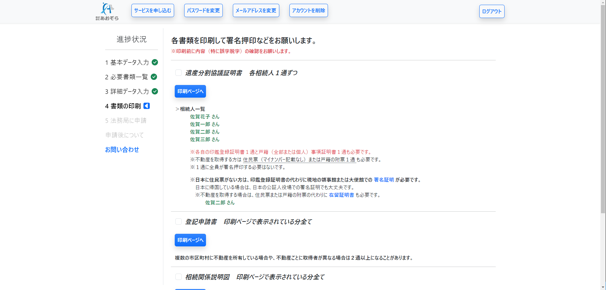
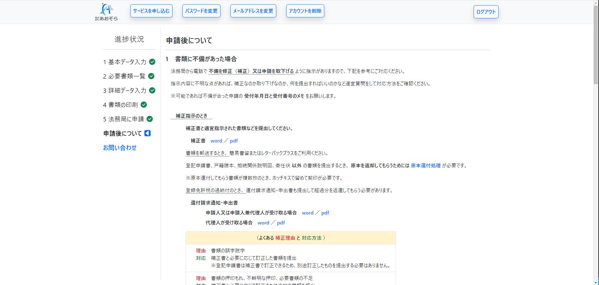
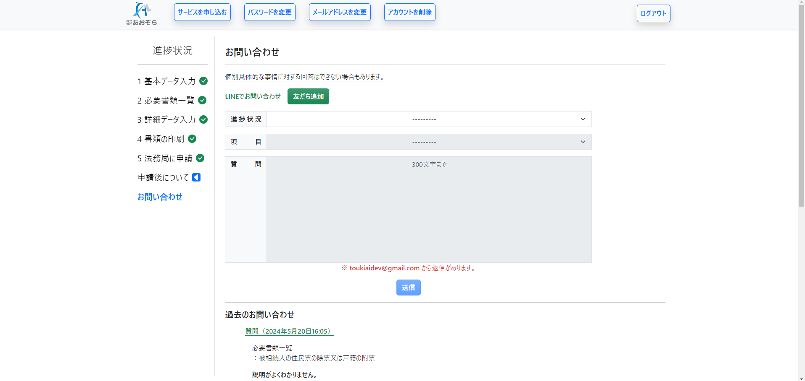

# そうぞくとうきくん

## 概要

「そうぞくとうきくん」は、相続を原因とする不動産の名義変更手続き（相続登記）を誰でも簡単に行えるようにするためのシステムです。

通常相続登記は司法書士に依頼して行うことが多いですが、司法書士の報酬が高いため、本システムを利用すると実費のみで手続きを完了することができます。

スマホやタブレットでのご利用にも対応しています。

## トップページ
以下のコンテンツがあります。  
- **お知らせ、更新情報**
- **システムを試用するページへのリンク**
- **システムの機能**
- **料金**
- **他社比較**
- **Q&A**
- **お問い合わせ**

ヘッダーには以下へのリンクがあります。  
- **手続きに関するお役立ち情報ページ**
- **システムを試用するページ**
- **ログインページ**
- **サービスの申し込みページ**

フッターには以下へのリンクがあります。  
- **利用規約**
- **プライバシーポリシー**
- **特定商取引法に基づく表記**
- **会社概要**

 
## 手続きに関するお役立ち情報
相続や相続登記についての知っておくと便利な情報を見ることができます。

 
## システムの試用
提示された入力事項を入力すると相続人の判定と必要書類の概要を確認することができます。

 
## サービスの申し込みページ
提供しているサービスには、システムの利用の他に書類取得の代行や提携司法書士の紹介があります。  
必要なサービスを選択して申し込むことができます。

お支払いはクレジットカードと振込に対応しています。

 
## 本システムのページ（必要書類の案内）
入力された相続人情報に基づいて手続きに必要な証明書の一覧を確認できます。

証明書の内容や取得方法など詳細な説明も確認できます。

 
## 本システムのページ（詳細データ入力）
手続きに必要な書類を作成するために必要な情報を入力します。

 
## 本システムのページ（書類の印刷）
入力された情報に基づいて書類が自動で作成されます。  

自動で作成された書類の参考例  

 
## 本システムのページ（申請準備）
収集、作成した書類の整理方法と申請先の法務局を確認できます。

 
## 本システムのページ（申請後について）
申請内容に不備があったときの対応方法や申請が完了した後に交付される書類の説明などを確認できます。

 
## システム利用中のお問い合わせ
システム利用中に不明な点があれば随時問い合わせをすることができます。

